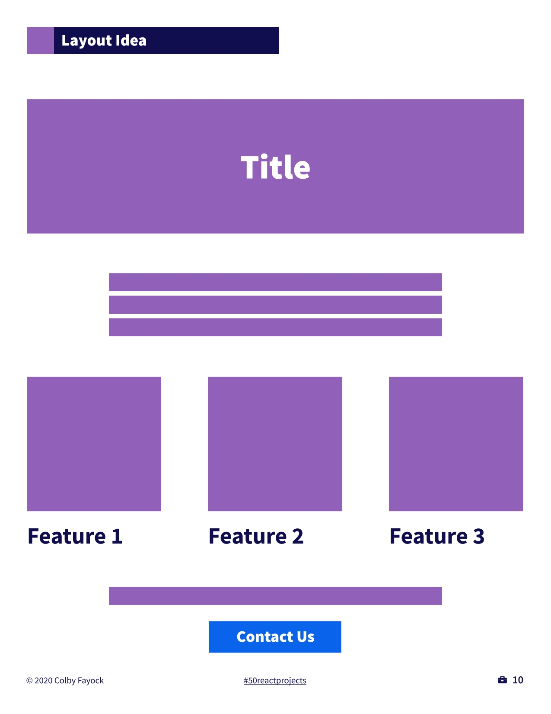

# Marketing Website

## Description
This project is a marketing website for a technology product. It includes a homepage, feature pages, a landing page, and a contact page, all built with React. The website is designed to showcase the product, inform visitors about its features, and provide a means to contact the company or sign up for more information.

## Features

- Homepage: An overview of the product with high-level information.
- Feature Pages: Detailed pages for each feature of the product.
- Landing Page: A page designed to convert visitors into leads.
- Contact Page: A form for visitors to contact the company.

## To-Do List

- [ ] Think of a product name
- [ ] Gather free pictures
- [ ] Create a homepage
- [ ] Create feature pages
- [ ] Create a landing page
- [ ] Add a signup form
- [ ] Create a contact page
- [ ] Add a contact form
- [ ] Add contact links to the site

## Layout

Layout idea for start, of our marketing website:

## Getting Started
To get started with the app, you can either:

- View the live demo - [Live](https://steelsnake93.github.io/marketing-website "<[Homepage url]> Live View")
- Clone this repository and run it locally on your machine.

### Prerequisites
To run this app locally, you will need to have the following software installed on your machine:

- Node.js
- npm or yarn package manager

## Installation
To install the app on your local machine, follow these steps:

- Clone this repository using Git or download the ZIP file.

      git clone https://github.com/steelsnake93/marketing-website.git
   
- Navigate to the project directory in your terminal or command prompt.
      
      cd marketing-website
   
- Install the required dependencies.
      
      npm install

- To start the development server.

      npm run dev 
    
    Open your web browser and go to http://localhost:5173/ to view the app.

### Usage
After starting the development server, you can navigate through the website using the links provided in the navigation bar. The website is divided into different pages, each serving a different purpose as outlined in the Features section above.

### Built with
- React - JavaScript library for building user interfaces
- Vite - Front-end build tool

### Contributing
Contributions are welcome! To contribute to this project, please fork the repository and create a pull request.

### Acknowledgments
- This project was inspired from 50 Projects
for React and the Static Web by [Colby Fayock
](https://github.com/colbyfayock).

### License
This project is licensed under the [MIT License](https://github.com/steelsnake93/marketing-website/blob/main/LICENSE).
